# H(div)-Conforming Discontinuous Galerkin Methods for Multiphase Flow

**Kyle Booker** — Master of Mathematics in Applied Mathematics, University of Waterloo, 2021
Supervisors: Prof. Sander Rhebergen, Prof. Nasser Mohieddin Abukhdeir

---

## Abstract

Computational fluid dynamics (CFD) is concerned with numerically solving and visualizing complex problems involving fluids, having numerous engineering applications. Modeling multiphase flow problems involves two or more fluids of different states, phases, or physical properties — for example, bubbly flows in boilers where accurate models are critical for operational safety.

This repository implements a **discontinuous Galerkin (DG) H(div)-conforming finite element method** for the incompressible Navier-Stokes equations and the two-fluid multiphase flow model. H(div)-conforming spaces (specifically Brezzi-Douglas-Marini, or BDM, elements) yield velocity solutions that are pointwise divergence-free to machine precision and pressure-robust — properties that standard finite difference or continuous Galerkin methods do not guarantee.

Simulations are performed using the [NGSolve](https://www.ngsolve.org/) finite element package. Two benchmark problems are included: a manufactured-solution convergence test on the unit square, and vortex shedding past a cylinder in a channel.

The full thesis is available in the [`Thesis/`](../Thesis/) directory.

---

## Background

The core numerical method solves:

```
u_t + div(u ⊗ u) - ν·div(grad(u)) + grad(p) = f
div(u) = 0
```

using BDM finite element spaces for velocity (H(div)-conforming, so the normal component of velocity is continuous across element boundaries) and L2 spaces for pressure. The viscous numerical flux is derived from an interior penalty DG formulation; the convective flux uses a local Lax-Friedrichs scheme.

Key properties of this approach:
- **Pointwise divergence-free** velocity to machine precision
- **Pressure-robust** — the velocity error does not depend on the pressure approximation
- Compatible with complex geometries via unstructured meshes

---

## Repository Structure

```
multiphase/
├── DG_INS_BDM_UNIT_TEST.py          # Convergence test: DG BDM elements on unit square
├── DG_INS_BDM_VORTEX_SHEDDING.py    # Simulation: vortex shedding past a cylinder
├── TAYLOR_HOOD_INS_BDM_UNIT_TEST.py # Convergence test: Taylor-Hood elements on unit square
├── requirements.txt                  # Python dependencies
└── README.md
```

| Script | Purpose | Output |
|--------|---------|--------|
| `DG_INS_BDM_UNIT_TEST.py` | Validates the DG BDM solver against a manufactured solution. Performs uniform mesh refinement and reports L2 errors in velocity, pressure, and divergence. | Convergence rate table printed to terminal; VTK files for visualization |
| `DG_INS_BDM_VORTEX_SHEDDING.py` | Simulates transient flow past a cylinder in a 2D channel (Re ≈ 100). Computes drag and lift coefficients via the Nitsche penalty method at each time step. | `drag.dat`, `lift.dat` |
| `TAYLOR_HOOD_INS_BDM_UNIT_TEST.py` | Same convergence test using continuous Taylor-Hood elements (VectorH1 × H1) for comparison against the DG approach. | Convergence rate table printed to terminal |

---

## Dependencies

This project requires [NGSolve](https://www.ngsolve.org/) and its bundled mesh generator Netgen.

```bash
pip install ngsolve
```

NGSolve bundles Netgen, numpy, and scipy. No additional packages are required.

Tested with Python 3.8+ and NGSolve 6.2.

---

## How to Run

### Convergence test (DG BDM elements)

```bash
python DG_INS_BDM_UNIT_TEST.py
```

Configurable parameters at the top of the file:

| Parameter | Default | Description |
|-----------|---------|-------------|
| `Polynomial_Order` | 3 | Degree of approximation polynomials |
| `No_Refinements` | 6 | Number of uniform mesh refinements |
| `Time_Step` | 1e-10 | Time step size (small → near-steady-state initial condition) |
| `nu` | 1 | Kinematic viscosity |

Expected output: a table of L2 errors and convergence rates across refinement levels, confirming optimal-order convergence.

### Convergence test (Taylor-Hood elements)

```bash
python TAYLOR_HOOD_INS_BDM_UNIT_TEST.py
```

### Vortex shedding simulation

```bash
python DG_INS_BDM_VORTEX_SHEDDING.py
```

Runs 1000 time steps (dt = 0.001) of flow past a cylinder at Re ≈ 100. Drag and lift coefficients are written to `drag.dat` and `lift.dat` at each step. These can be plotted with any standard tool (e.g., matplotlib, MATLAB, gnuplot).

---

## Results

### Unit Square — BDM Elements (Figure 3.1)

Approximate velocity (horizontal, vertical, magnitude) and pressure obtained using BDM elements on a refined unit square mesh at t = 0.

| Horizontal velocity | Vertical velocity |
|:-------------------:|:-----------------:|
| 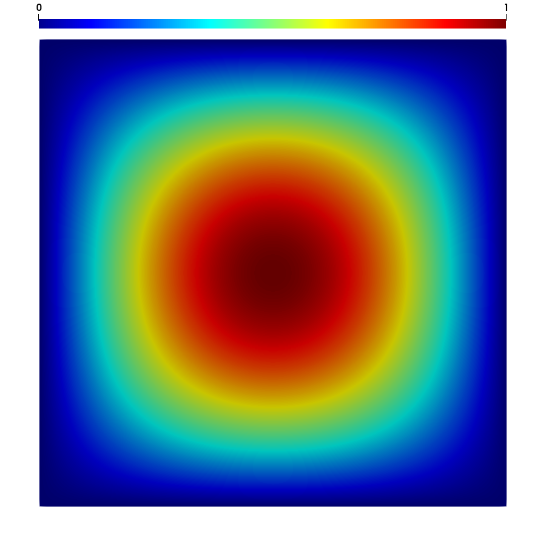 | 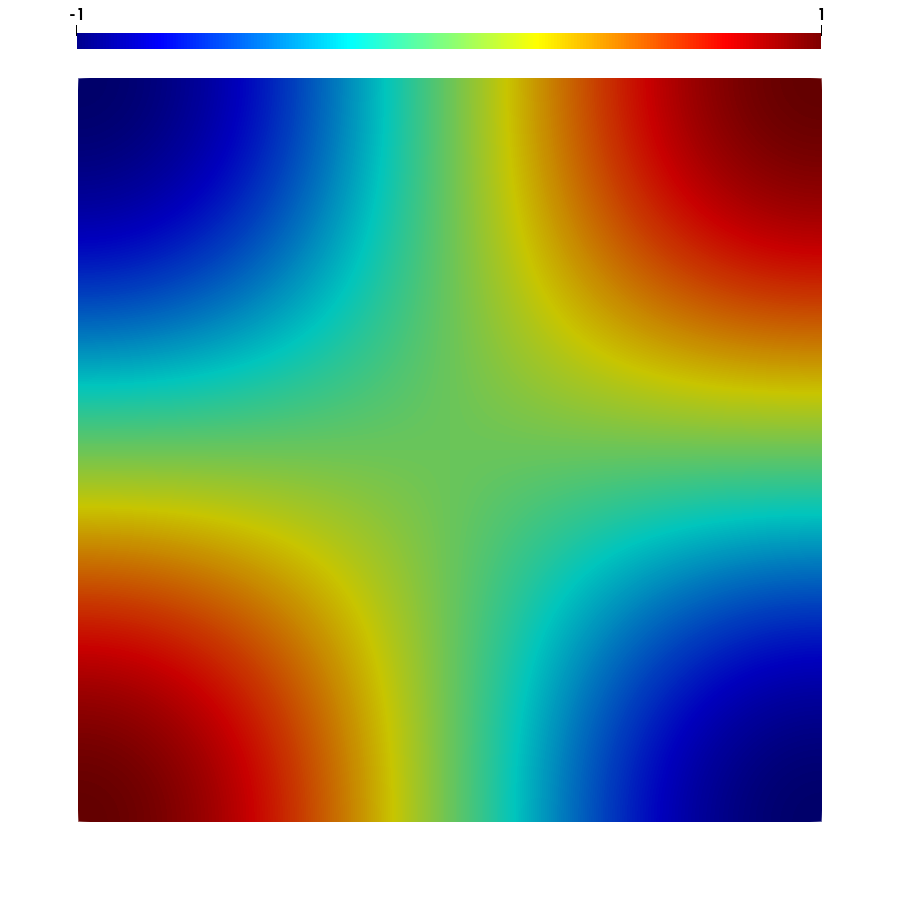 |

| Velocity magnitude | Pressure |
|:------------------:|:--------:|
| 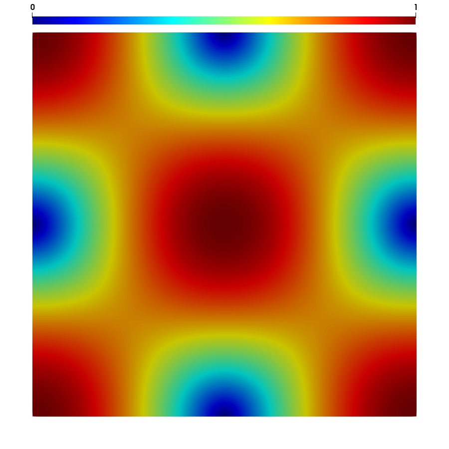 | 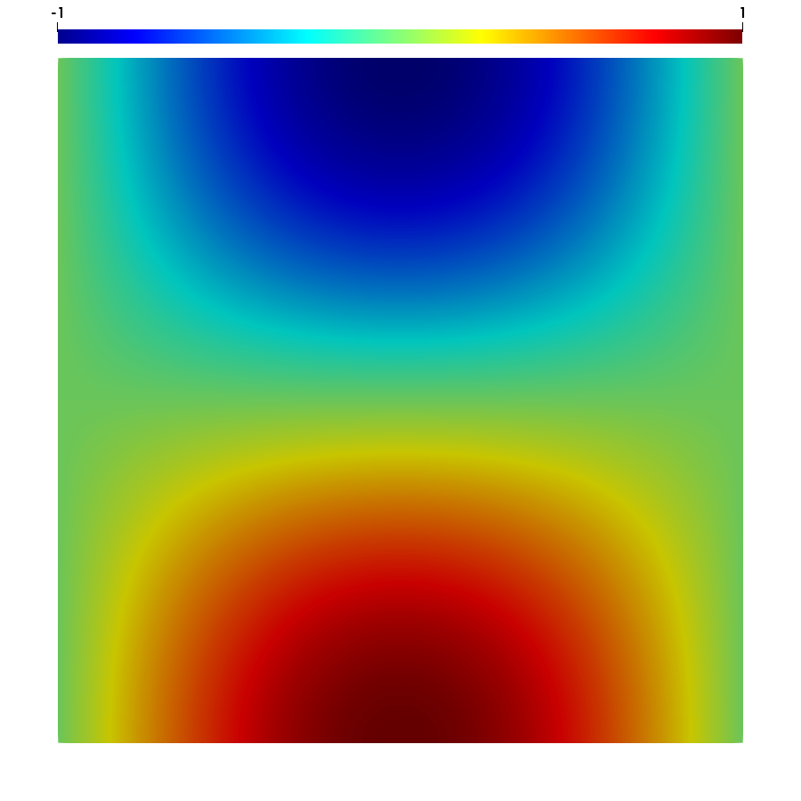 |

---

### Vortex Shedding — Flow Past a Cylinder

Horizontal velocity (top), vertical velocity (middle), and pressure (bottom) in a 2D channel at Re ≈ 100.

**t = 0 (Figure 3.3)**

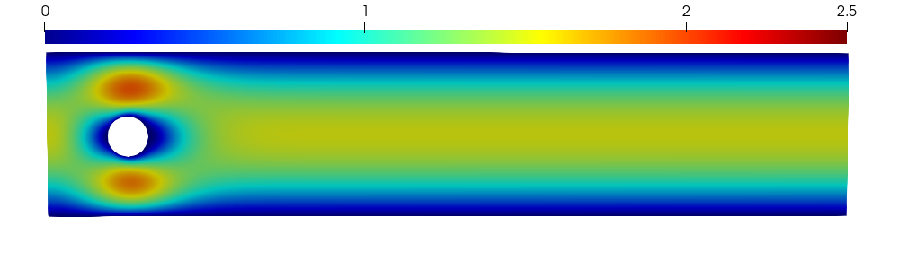
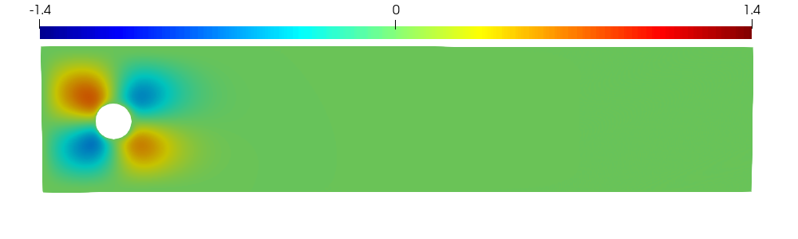
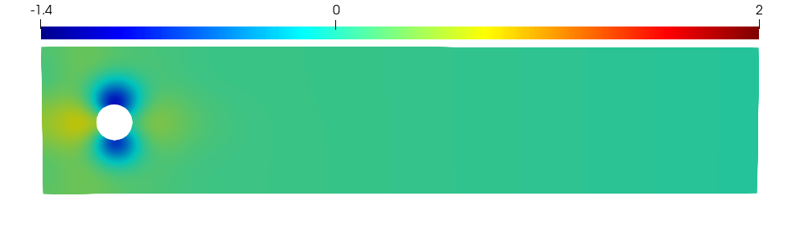

**t = 0.5 (Figure 3.4)**

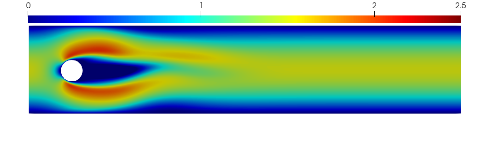
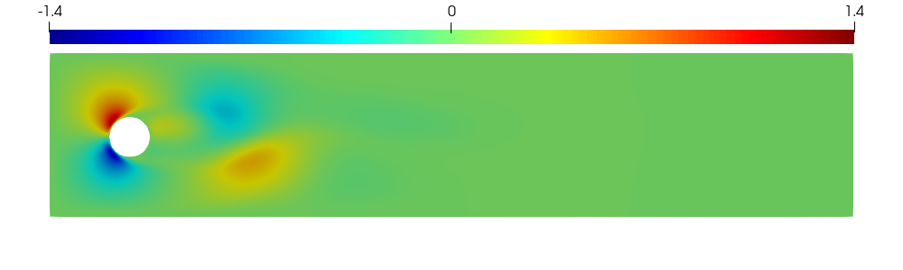
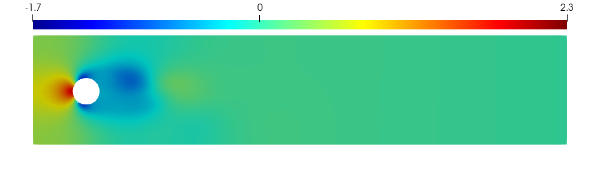

**t = 2.0 (Figure 3.5)**

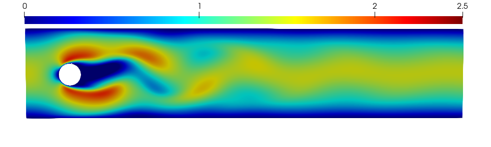
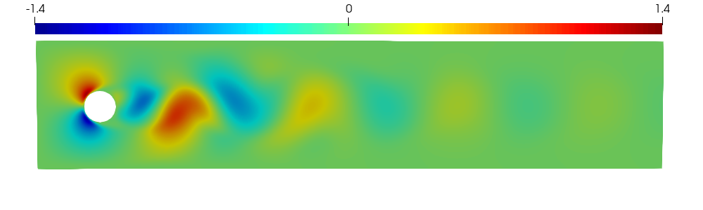
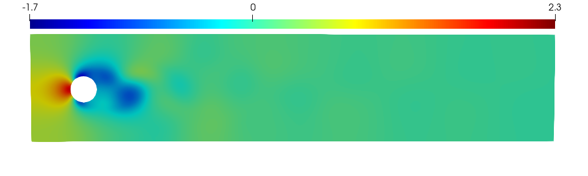

---

## Citation

If you use this code in your research, please cite the associated thesis:

```bibtex
@mastersthesis{booker2021hdiv,
  author  = {Booker, Kyle},
  title   = {{H(div)}-Conforming Discontinuous {Galerkin} Methods for Multiphase Flow},
  school  = {University of Waterloo},
  year    = {2021},
  address = {Waterloo, Ontario, Canada},
  type    = {Master of Mathematics}
}
```

---

## License

This project is licensed under the MIT License. See [LICENSE](LICENSE) for details.
